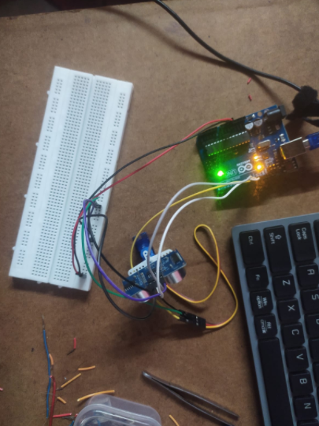
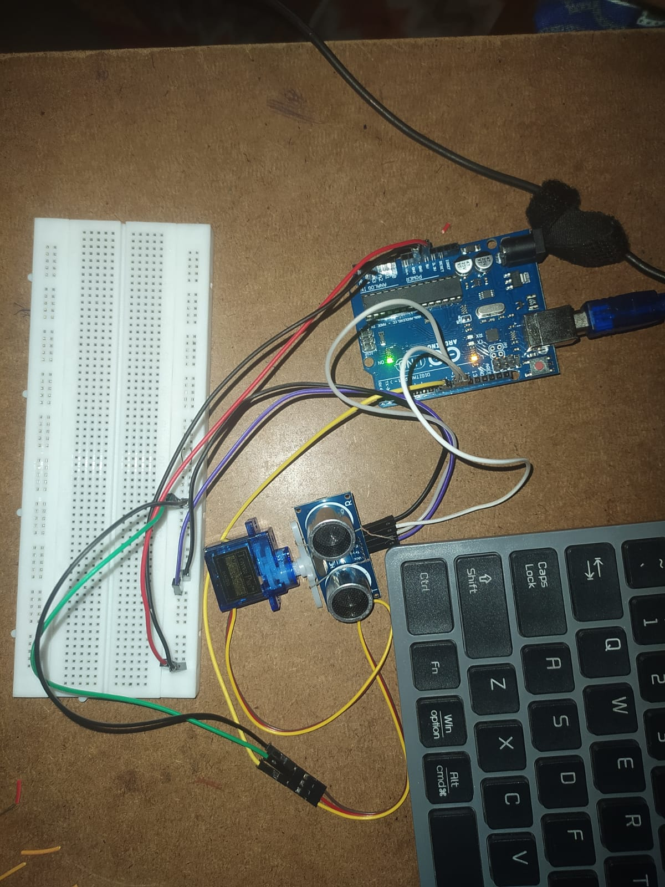
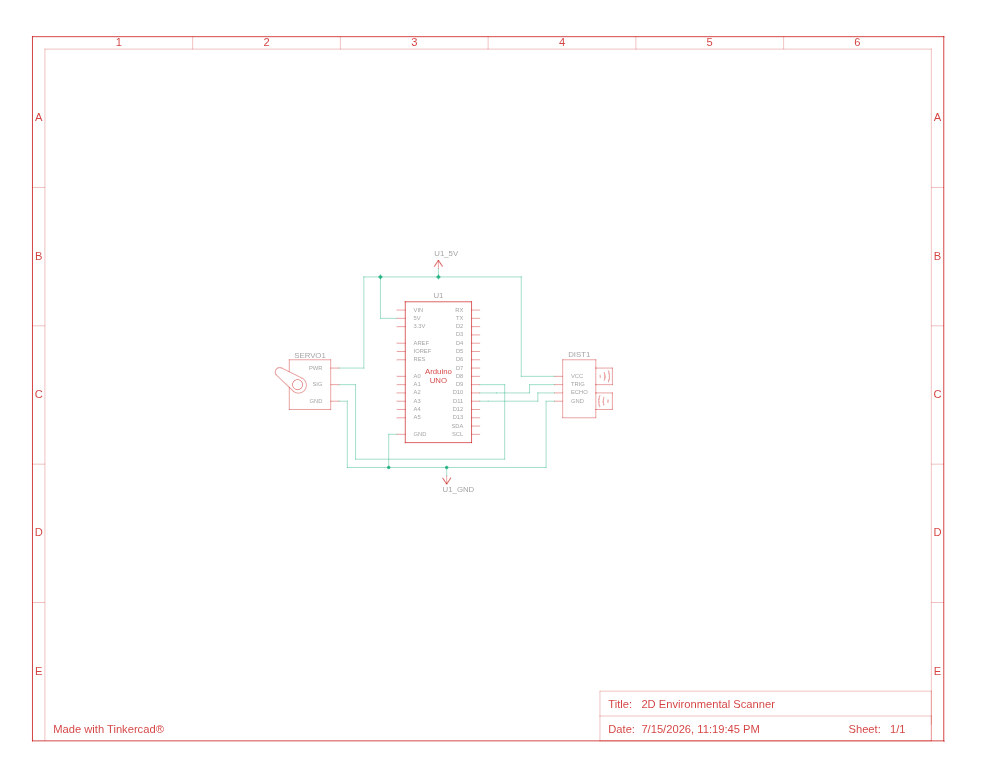
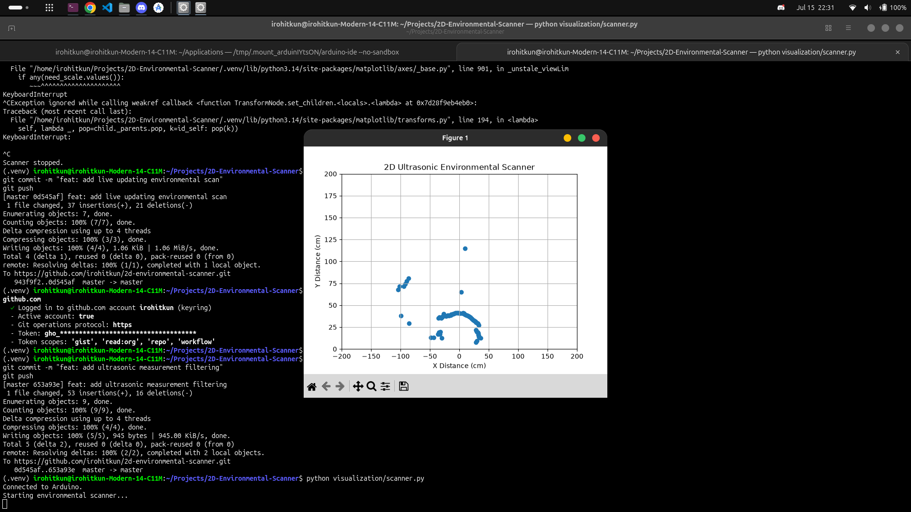
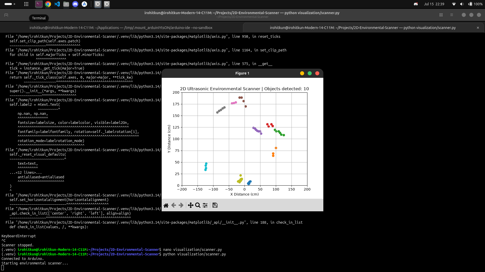

# 2D Ultrasonic Environmental Scanner

A real-time 2D environmental scanning prototype built using an **Arduino Uno**, **HC-SR04 ultrasonic sensor**, **SG90 servo motor**, and a **Python visualization application**.

The system mechanically sweeps an ultrasonic sensor across the environment, collects distance measurements at different angles, filters the sensor readings, and transmits the resulting angle-distance data to a computer over serial communication.

A Python application processes the incoming data, converts polar measurements into Cartesian coordinates, generates a live 2D environmental map, and performs basic spatial segmentation to group nearby measurements into potential obstacle or object clusters.

## Prototype

### Hardware Setup

The HC-SR04 ultrasonic sensor is mounted directly onto the rotating servo mechanism. As the servo sweeps through its configured angular range, the sensor rotates with it and measures the distance in each direction.



### Close View

A close view of the prototype scanning mechanism and sensor assembly.



### Circuit Schematic

The following schematic shows the wiring used in the prototype. The SG90 servo and HC-SR04 ultrasonic sensor are powered from the Arduino Uno's 5V supply and share a common ground.

- Servo signal: D9
- HC-SR04 TRIG: D10
- HC-SR04 ECHO: D11



### Live 2D Environmental Scan

The Arduino transmits measurements in the form:

```text
angle,distance
```

The Python application receives this data and converts each measurement from polar coordinates into Cartesian coordinates:

```text
x = distance × cos(angle)
y = distance × sin(angle)
```

The resulting points are plotted in real time to create a 2D representation of the scanned environment.



### Spatial Object Segmentation

The visualization also implements an experimental spatial segmentation algorithm.

Measurements from neighboring scan angles are compared based on their distance difference. Consecutive measurements with similar distances are grouped into clusters representing potential objects or obstacle surfaces.

Small clusters are rejected to reduce the effect of isolated noisy measurements.



> The system performs spatial clustering, not object recognition. It can detect and separate potential obstacle regions but cannot identify what an object actually is.

## Features

- Servo-driven 2D ultrasonic scanning
- Bidirectional angular sweep
- Real-time HC-SR04 distance measurement
- Multi-sample ultrasonic measurement filtering
- Invalid measurement rejection
- Arduino-to-Python serial communication
- Polar-to-Cartesian coordinate conversion
- Real-time 2D visualization using Matplotlib
- Basic spatial object/obstacle segmentation
- Independent hardware test sketches

## Hardware Used

| Component | Quantity |
| --- | ---: |
| Arduino Uno R3 | 1 |
| HC-SR04 Ultrasonic Sensor | 1 |
| SG90 Micro Servo | 1 |
| Breadboard | 1 |
| Jumper Wires | As required |
| USB Cable | 1 |

## Wiring

| Component | Pin | Arduino Connection |
| --- | --- | --- |
| Servo | Signal | D9 |
| Servo | VCC | 5V |
| Servo | GND | GND |
| HC-SR04 | TRIG | D10 |
| HC-SR04 | ECHO | D11 |
| HC-SR04 | VCC | 5V |
| HC-SR04 | GND | GND |

The servo and ultrasonic sensor must share a common ground with the Arduino.

## System Architecture

```text
                    ┌──────────────┐
                    │ Arduino Uno  │
                    └──────┬───────┘
                           │
                 Controls Servo Angle
                           │
                           ▼
                    ┌──────────────┐
                    │ SG90 Servo   │
                    └──────┬───────┘
                           │
                     Rotates Sensor
                           │
                           ▼
                    ┌──────────────┐
                    │   HC-SR04    │
                    └──────┬───────┘
                           │
                  Distance Measurement
                           │
                           ▼
                    ┌──────────────┐
                    │ Arduino Uno  │
                    └──────┬───────┘
                           │
                    angle,distance
                       via Serial
                           │
                           ▼
                    ┌──────────────┐
                    │    Python    │
                    └──────┬───────┘
                           │
              Polar → Cartesian Conversion
                           │
                           ▼
                 Real-Time 2D Visualization
                           │
                           ▼
                  Spatial Segmentation
```

## How It Works

For each position in the scanning range:

1. The Arduino commands the servo to move to a specific angle.
2. The HC-SR04 rotates together with the servo.
3. Multiple ultrasonic measurements are collected.
4. Invalid measurements are rejected.
5. Valid measurements are averaged to reduce noise.
6. The Arduino sends the angle and filtered distance over the serial connection.
7. Python receives the measurement.
8. The polar coordinate is converted into an `(x, y)` Cartesian coordinate.
9. The environmental map is updated in real time.
10. Neighboring measurements are analyzed and grouped into spatial clusters.

The scanner continuously sweeps in both directions.

## Repository Structure

```text
2D-Environmental-Scanner/
├── firmware/
│   └── EnvironmentalScanner/
│       └── EnvironmentalScanner.ino
│
├── tests/
│   ├── ServoSweepTest/
│   │   └── ServoSweepTest.ino
│   └── UltrasonicSensorTest/
│       └── UltrasonicSensorTest.ino
│
├── visualization/
│   └── scanner.py
│
├── screenshots/
│   ├── close-view.png
│   ├── live-scan.png
│   ├── object-segmentation.png.png
│   └── prototype.png
│
├── .gitignore
├── requirements.txt
└── README.md
```

## Software Requirements

### Arduino

The firmware is designed for an Arduino Uno and uses the Arduino Servo library.

### Python

The visualization requires:

- Python 3
- PySerial
- Matplotlib

Install the required Python packages using:

```bash
pip install -r requirements.txt
```

## Running the Project

### 1. Upload the Arduino Firmware

Open:

```text
firmware/EnvironmentalScanner/EnvironmentalScanner.ino
```

in the Arduino IDE.

Select the correct Arduino Uno board and serial port, then upload the sketch.

### 2. Connect the Arduino

Connect the Arduino to the computer through USB.

The current Python implementation expects the serial device:

```text
/dev/ttyACM0
```

This may need to be changed in `scanner.py` depending on the operating system and assigned serial port.

### 3. Run the Visualization

From the project directory:

```bash
python visualization/scanner.py
```

The visualization window should open and begin displaying measurements received from the Arduino.

## Development and Testing

The project was developed by testing each major hardware subsystem independently before integration.

### Ultrasonic Sensor Test

`tests/UltrasonicSensorTest/UltrasonicSensorTest.ino`

Used to verify HC-SR04 distance measurements independently.

### Servo Sweep Test

`tests/ServoSweepTest/ServoSweepTest.ino`

Used to verify smooth servo movement across the required scanning range.

After both subsystems were verified independently, the ultrasonic sensor was physically mounted to the servo and the systems were integrated into the complete environmental scanner.

## Measurement Filtering

Raw ultrasonic measurements may contain invalid readings or sudden fluctuations.

To improve measurement stability, the Arduino firmware:

1. Takes multiple distance measurements at each angle.
2. Rejects measurements outside the configured valid range.
3. Averages the remaining valid samples.
4. Sends the filtered result to the visualization application.

This reduces ordinary measurement noise before the data reaches the Python processing stage.

## Spatial Segmentation

The current segmentation algorithm compares measurements from consecutive scanning angles.

If neighboring measurements:

- Are sufficiently close in angle, and
- Have a distance difference below a configured threshold,

they are considered part of the same spatial cluster.

Clusters containing too few measurements are discarded as potential noise.

This is a heuristic approach intended as an experimental foundation for more advanced environmental mapping.

## Limitations

- HC-SR04 measurements are affected by surface shape, orientation, and material.
- Ultrasonic reflections can produce noisy or missing measurements.
- A single ultrasonic sensor provides relatively low spatial resolution.
- The segmentation algorithm uses fixed thresholds.
- One physical surface may occasionally be divided into multiple clusters.
- Different nearby objects may occasionally be grouped into one cluster.
- The system performs obstacle segmentation, not object classification.
- The current visualization requires a computer connected through USB.

## Future Improvements

- Median filtering for improved outlier rejection
- Adaptive segmentation thresholds
- Object centroid estimation
- Object distance and angular-range labels
- Persistent cluster tracking between consecutive sweeps
- Automatic serial-port detection
- Scan recording and playback
- Improved real-time visualization
- Dedicated 3D-printed servo and ultrasonic sensor mount
- Independent power supply for the servo
- More advanced spatial mapping algorithms

## Project Status

**Functional Prototype**

The core hardware and software pipeline has been physically tested:

```text
Servo Sweep
    ↓
Ultrasonic Measurement
    ↓
Measurement Filtering
    ↓
Serial Communication
    ↓
Python Data Processing
    ↓
2D Environmental Visualization
    ↓
Spatial Segmentation
```

The current version serves as a working proof of concept and a foundation for future improvements in environmental sensing and spatial mapping.
